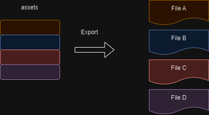

# How Webpack work?

## Webpack compilation process

#### 3 Steps of webpack compilation process:
1. Initiliazation
2. Compilation
3. Export

### Initiliazation

Webpack will mix all CLI parameters, configuration files and default configuration into the final configuration object

| Note |
|------|
| <b>Example CLI parameters</b> |
|`npx webpack -- mode = devxxx --config xxx`|
| <b>Configuration files</b> |
| normally is `webpack.config.js`|
| <b>Default configuration</b>|
| Like default entry point will be `./src/index.js`|

Process of configuration will completed by thrid party - <b>yargs</b> (able to found in node moduels folder) 

This process is to prepare the final configuration object for the next step

### Compilation

#### 1. Create Chunk

Create chunk based on entry point (default <b>./src/index.js</b>)

All chunks have below attributes:

- name: default as <b>main</b>
- id: uniqe number, *developement environment* will same with name, *production environment* will start with 0.

#### 2. Build all dependent modules

#### 3. Generate chunk assets

Webpack will generate a chunk assets list based on the configuration.

| Note |
|------|
| <b>Chunk hash</b> |
| Chunk hash is a hash string generated based on the contents of all chunk assets.|
|<b>Hash</b>|
|Hash is an algorithm that converts a string of random length into a string of specific length, and can guarantee that if the content has not changed, the hash string will not change |

##### Simplified diagram

#### 4. Combine chunk assets

Combine all chunk's assets together, and generate a final hash

### Export

Webpack will use the fs module (file processing module) inside node to generate relevant files based on the final asset file generated by compilation. 

> [!NOTE]
> Involving terminology
> 1. Module: module, a divided code unit. The module in webpack can be of any content.
Files, not just JS
> 2. Chunk: The block that builds modules inside webpack. A chunk contains multiple modules. These modules are obtained from the entry module through dependency analysis.
> 3. Bundle: After the chunk module is built, the assets list of the chunk will be generated. Each item in the list is a bundle. The bundle can be considered to be the final generated file.
> 4. Hash: The hash value generated by the union of all contents of the final resource list
> 5. chunkhash: the hash value generated by combining the contents of the assets list generated by chunk
> 6. chunkname: the name of the chunk, if not configured, use main
> 7. id: usually refers to the unique number of the chunk. If it is built in the development environment, it is the same as the chunkname; if it is built in the production environment, it is numbered with a number starting from the beginning.
